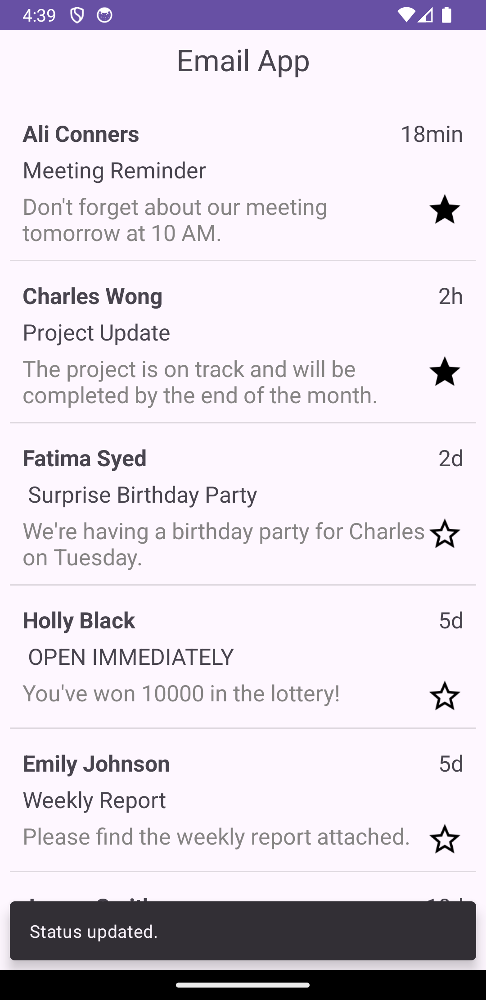
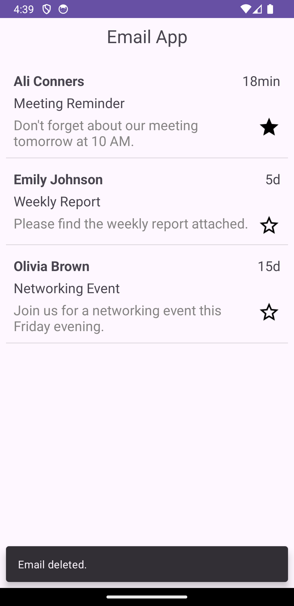

# Email App

<table>
  <tr>
    <td></td>
    <td></td>
  </tr>
</table>

## Description

This Android application, developed with XML and Kotlin, implements a RecyclerView adapter with a custom layout for the rows. The app allows users to delete an email by tapping on the row and update the importance status by tapping the star icon. Interfaces are used to handle these interactions cleanly, ensuring a modular and maintainable codebase. Additionally, the app implements SnackBars, providing quick feedback to the user. This project showcases modern Android development practices, including custom layouts, RecyclerView Adapters, Interface-based event handling, and user-friendly notifications with SnackBars.

## Features

- **Kotlin**: Used for developing the application's logic.
- **XML**: Used for designing the user interface.
- **Binding**: For efficient and safe access to UI components.
- **OOP**: Demonstrates object-oriented programming principles.
- **RecyclerView Adapter**: To efficiently manage and display a list of data items in a RecyclerView.
- **Custom Layout**: To design a custom row layout specifically for the adapter.
- **Interface**: To handle user interactions and provide a clean separation of concerns
- **Snackbar**: To provides a quick feedback to users triggered by click events.

## Required Configuration

- No additional configuration is required.

## Demo

Here are some screenshots of the application:

<table>
  <tr>
    <td></td>
    <td></td>
  </tr>
</table>

## License 

The MIT License (MIT)

- **Copyright (c) 2024 Jonathan Reátegui**

Permission is hereby granted, free of charge, to any person obtaining a copy of this software and associated documentation files (the "Software"), to deal in the Software without restriction, including without limitation the rights to use, copy, modify, merge, publish, distribute, sublicense, and/or sell copies of the Software, and to permit persons to whom the Software is furnished to do so, subject to the following conditions:

The above copyright notice and this permission notice shall be included in all copies or substantial portions of the Software.

THE SOFTWARE IS PROVIDED "AS IS", WITHOUT WARRANTY OF ANY KIND, EXPRESS OR IMPLIED, INCLUDING BUT NOT LIMITED TO THE WARRANTIES OF MERCHANTABILITY, FITNESS FOR A PARTICULAR PURPOSE AND NONINFRINGEMENT. IN NO EVENT SHALL THE AUTHORS OR COPYRIGHT HOLDERS BE LIABLE FOR ANY CLAIM, DAMAGES OR OTHER LIABILITY, WHETHER IN AN ACTION OF CONTRACT, TORT OR OTHERWISE, ARISING FROM, OUT OF OR IN CONNECTION WITH THE SOFTWARE OR THE USE OR OTHER DEALINGS IN THE SOFTWARE.

## Notes

- This README is also available in Spanish  [here](README-es.md)
- Este README también está disponible en español  [aquí](README-es.md)
